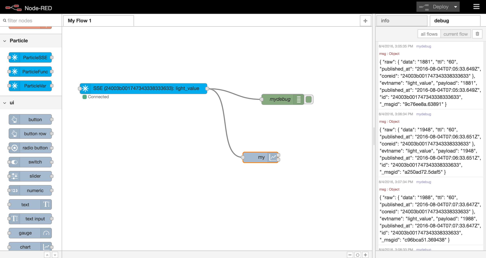
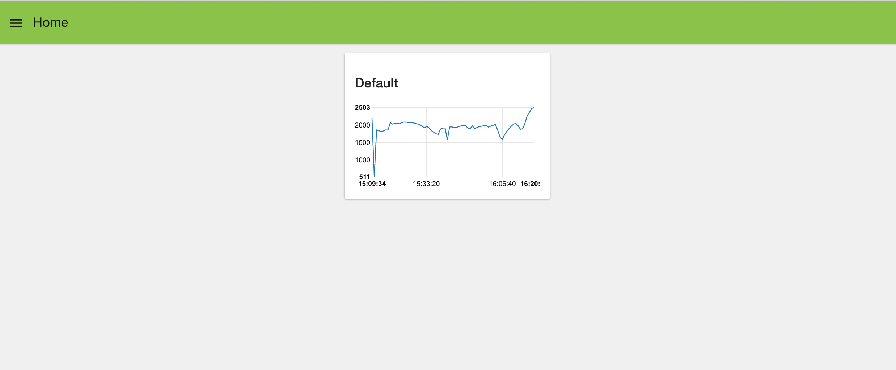
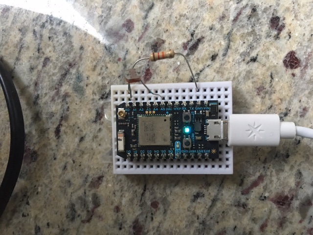

### Monitor light level with a Particle.io board and send data to cloud and node-red for visualization

This project uses the http://particle.io board to monitor light levels in a room, and then push the data periodically to the Particle Cloud, where it is then picked up by node-red for visualization (or other processing).

This may appear to be a relatively trivial application however it can be seen as the basis for many other more useful applications.  For example, a slight modification to the circuit could allow you to measure most any sensor that produces an analog output.  Additionally, once you learn how to measure digital inputs, that opens up other sensor possibilities, from simple things like door open/close sensors to radiation measurement devices.

The Publish feature of the Particle places the data on a message queue that can either be private to you, or public to anyone.  This means others can monitor your data.

The inclusion of node-red allows the easy building of "flows" that allow all sorts of processing, filtering, and other data processing, without programming.  So for example you could publish your data publicly and allow some school kids, who can't program,  to build a quick visualization of your data in a browser.  Or you could have node-red send you an email if the data met some particular threshold.

Circuit:
- Place a CDS cell across pins A0 and A5 pins
- Place a 12k ohm resistor across A0 and GND pins

The code is well-commented.

#### Node-red
This is an IBM open source tool at http://nodered.org.  Beyond the scope of this document to explain what node-red does.  I've included the node-red file so you can try it out.  It requires:

- https://www.npmjs.com/package/node-red-contrib-ui
- https://www.npmjs.com/package/node-red-contrib-particle

